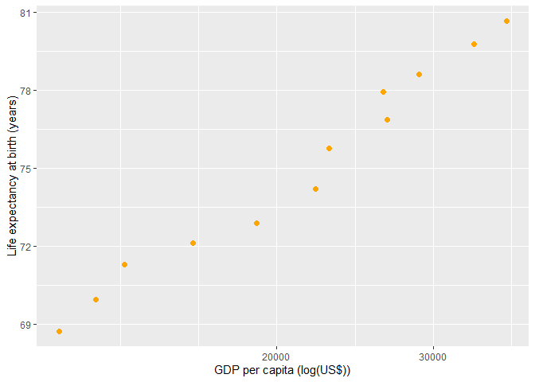
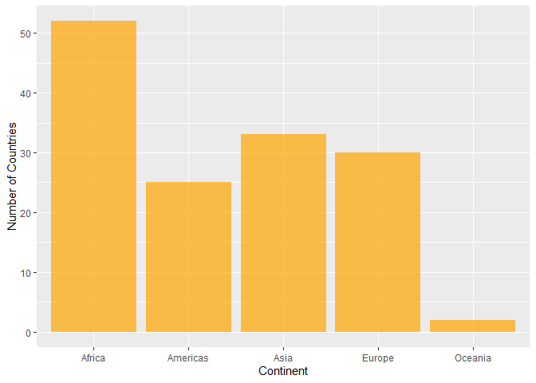
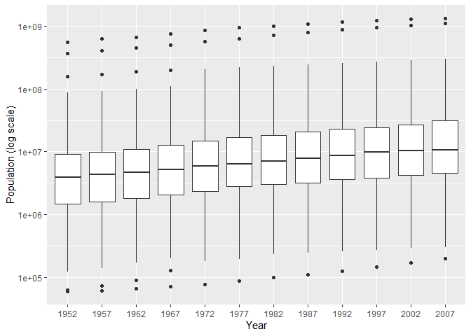
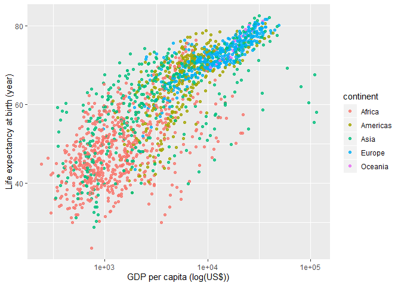
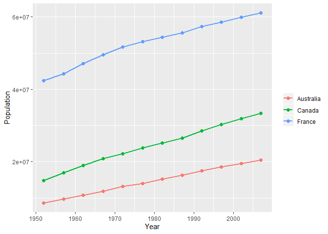

Assignment 2 - `dplyr` exploration
================
Lulu Pei
22/09/2019

  - [Overview](#overview)
  - [Question 1 - Basic `dplyr`](#question-1---basic-dplyr)
      - [*1.1 - Filtering*](#filtering)
      - [*1.2 - Selecting*](#selecting)
      - [*1.3 - Mutating*](#mutating)
      - [*1.4 - Slicing*](#slicing)
      - [*1.5 - Plotting*](#plotting)
  - [Question 2 - Variable
    Exploration](#question-2---variable-exploration)
      - [*2.1 - Categorical*](#categorical)
      - [*2.2 - Quantitative*](#quantitative)
  - [Question 3 - Plot Exploration](#question-3---plot-exploration)
      - [*3.1 - Scatterplot*](#scatterplot)
      - [*3.2 - Time Series*](#time-series)
  - [Bonus - Recycling](#bonus---recycling)

# Overview

Before playing around with the various `dplyr` commands, we must define
a dataset. In this case, we will be looking at the `gapminder` dataset.
To access the `gapminder` dataset, we need to load the `gapminder`
package. To be able to call and use `dplyr` commands, we must load the
`tidyverse` package as well.

``` r
library(gapminder)
library(tidyverse)
```

# Question 1 - Basic `dplyr`

## *1.1 - Filtering*

Filter `gapminder` data to contain only observations from Canada, the
United States, and Mexico in the 1970s.

``` r
gapminder %>%
  filter(country == "Canada" | country == "United States" | country == "Mexico",
         year >= 1970 & year < 1980) %>%
  knitr::kable()
```

| country       | continent | year | lifeExp |       pop | gdpPercap |
| :------------ | :-------- | ---: | ------: | --------: | --------: |
| Canada        | Americas  | 1972 |  72.880 |  22284500 | 18970.571 |
| Canada        | Americas  | 1977 |  74.210 |  23796400 | 22090.883 |
| Mexico        | Americas  | 1972 |  62.361 |  55984294 |  6809.407 |
| Mexico        | Americas  | 1977 |  65.032 |  63759976 |  7674.929 |
| United States | Americas  | 1972 |  71.340 | 209896000 | 21806.036 |
| United States | Americas  | 1977 |  73.380 | 220239000 | 24072.632 |

## *1.2 - Selecting*

Let’s select only `country` and `gdpPercap` variables from our filtered
subset of the `gapminder` dataset.

``` r
gapminder %>%
  filter(country == 'Canada' | country == 'United States' | country == 'Mexico',
         year >= 1970 & year < 1980) %>%
  select(country, gdpPercap) %>%
  knitr::kable()
```

| country       | gdpPercap |
| :------------ | --------: |
| Canada        | 18970.571 |
| Canada        | 22090.883 |
| Mexico        |  6809.407 |
| Mexico        |  7674.929 |
| United States | 21806.036 |
| United States | 24072.632 |

## *1.3 - Mutating*

Suppose we want to look at all the countries that have ever experienced
a drop in life expectancy between 1952 and 2007. Let’s define a new
variable `lifeExp_change`, equaling the difference between life
expectancy at one time point and life expectancy at the time point
before (5 years earlier).

``` r
gapminder %>%
  group_by(country) %>%
  arrange(year) %>%
  mutate(lifeExp_change = lifeExp - lag(lifeExp)) %>%
  filter(lifeExp_change < 0)
```

    # A tibble: 102 x 7
    # Groups:   country [52]
       country        continent  year lifeExp      pop gdpPercap lifeExp_change
       <fct>          <fct>     <int>   <dbl>    <int>     <dbl>          <dbl>
     1 China          Asia       1962    44.5   6.66e8      488.        -6.05  
     2 Cambodia       Asia       1972    40.3   7.45e6      422.        -5.10  
     3 Czech Republic Europe     1972    70.3   9.86e6    13108.        -0.0900
     4 Netherlands    Europe     1972    73.8   1.33e7    18795.        -0.0700
     5 Slovak Republ~ Europe     1972    70.4   4.59e6     9674.        -0.63  
     6 Bulgaria       Europe     1977    70.8   8.80e6     7612.        -0.09  
     7 Cambodia       Asia       1977    31.2   6.98e6      525.        -9.10  
     8 El Salvador    Americas   1977    56.7   4.28e6     5139.        -1.51  
     9 Poland         Europe     1977    70.7   3.46e7     9508.        -0.180 
    10 Uganda         Africa     1977    50.4   1.15e7      844.        -0.666 
    # ... with 92 more rows

We can see that many countries have experienced a drop in life
expectancy at some point between 1952 and 2007; however, what if we are
only interested in countries that have experienced an overall life
expectancy drop between the most recent year (2007) and the earliest
year (1952).

``` r
gapminder %>%
  filter(year == 1952 | year == 2007) %>%
  group_by(country) %>%
  arrange(year) %>%
  mutate(lifeExp_change = lifeExp - lag(lifeExp)) %>%
  filter(lifeExp_change < 0) %>%
  knitr::kable()
```

| country   | continent | year | lifeExp |      pop | gdpPercap | lifeExp\_change |
| :-------- | :-------- | ---: | ------: | -------: | --------: | --------------: |
| Swaziland | Africa    | 2007 |  39.613 |  1133066 | 4513.4806 |         \-1.794 |
| Zimbabwe  | Africa    | 2007 |  43.487 | 12311143 |  469.7093 |         \-4.964 |

From this output, we can see that the only countries that experienced an
overall decline in life expectancy between 1952 and 2007 were Swaziland
and Zimbabwe, with a decline of 1.794 and 4.964 years, respectively.

## *1.4 - Slicing*

Now, let’s filter the `gapminder` dataset to show the maximum GDP per
capita experienced by each country.

``` r
gapminder %>%
  select(country, year, gdpPercap) %>%
  group_by(country) %>%
  mutate(max_gdpPercap = max(gdpPercap)) %>%
  filter(max_gdpPercap == gdpPercap) %>%
  select(country, year, max_gdpPercap)
```

    # A tibble: 142 x 3
    # Groups:   country [142]
       country      year max_gdpPercap
       <fct>       <int>         <dbl>
     1 Afghanistan  1982          978.
     2 Albania      2007         5937.
     3 Algeria      2007         6223.
     4 Angola       1967         5523.
     5 Argentina    2007        12779.
     6 Australia    2007        34435.
     7 Austria      2007        36126.
     8 Bahrain      2007        29796.
     9 Bangladesh   2007         1391.
    10 Belgium      2007        33693.
    # ... with 132 more rows

This output allows us to determine the maximum GDP per capita
experienced by each country between 1952 and 2007, and also in which
year it was experienced.

## *1.5 - Plotting*

Let’s investigate the relationship between life expectancy and GDP per
capita in Canada. To do this, we will create a scatterplot using
`ggplot2`.

``` r
gapminder %>%
  filter(country == "Canada") %>%
  ggplot(aes(gdpPercap, lifeExp)) +
  geom_point(colour = "orange", size = 2) +
  scale_x_log10() +
  xlab("GDP per capita (log(US$))") +
  ylab("Life expectancy at birth (years)")
```



From this plot, we can see that in Canada, life expectancy has been
increasing relatively linearly with the log transform of GDP per capita
between the years of 1952 and 2007.

# Question 2 - Variable Exploration

To perform individual variable exploration using `dplyr` we will choose
one categorical variable and one quantitative variable to explore. Let’s
say we want to analyze `continent` as the categorical variable and
`population` as the quantitative variable.

## *2.1 - Categorical*

The categorical variable we are interested in exploring is `continent`.
To start off, let’s first investigate which continents are represented
in our `gapminder` dataset.

``` r
levels(gapminder$continent)
```

    [1] "Africa"   "Americas" "Asia"     "Europe"   "Oceania" 

Categorical variable exploration is usually performed through the
generation of frequency tables - let’s generate one for the `continent`
variable.

``` r
gapminder %>%
  count(continent) %>%
  rename(count = n) %>%
  knitr::kable()
```

| continent | count |
| :-------- | ----: |
| Africa    |   624 |
| Americas  |   300 |
| Asia      |   396 |
| Europe    |   360 |
| Oceania   |    24 |

This command prints out the number of observations for each continent in
our dataset. However, by looking at the `gapminder` dataset, we see that
each country contributes 12 observations (represeting 12 time points) to
the dataset. Suppose we want to know how many countries are in each
continent for the `gapminder` dataset. To determine this, we need to
remove replicates of the same country. The simpliest way to achieve this
is to consider continent counts at each individual time point.

``` r
gapminder %>%
  group_by(year) %>%
  count(continent) %>%
  rename(country_count = n)
```

    # A tibble: 60 x 3
    # Groups:   year [12]
        year continent country_count
       <int> <fct>             <int>
     1  1952 Africa               52
     2  1952 Americas             25
     3  1952 Asia                 33
     4  1952 Europe               30
     5  1952 Oceania               2
     6  1957 Africa               52
     7  1957 Americas             25
     8  1957 Asia                 33
     9  1957 Europe               30
    10  1957 Oceania               2
    # ... with 50 more rows

We see that country distirbution does not change from year to year -
there are the same number of countries in each of the 5 continents:
Africa, the Americas, Asia, Europe, and Oceania. In our dataset, 52
countries are represented from Africa, 25 countries from the Americas,
33 countries from Asia, 30 countries from Europe, and 2 countries from
Oceania. Let’s view this data graphically using a bar graph - because
continent counts do not change between years, it is sufficient to plot
data from a single time point.

``` r
gapminder %>%
  filter(year == 2007) %>%
  ggplot(aes(continent)) +
  geom_bar(fill = "orange", alpha = 0.7) +
  ylab("Number of Countries") +
  xlab("Continent")
```



## *2.2 - Quantitative*

Quantitative variable exploration is usually performed through the
generation of 5-number summaries: min, 1st quartile, median, 3rd
quartile, max. Let’s generate a variation of the 5-number summary for
the `pop` variable, including a measure of spread.

``` r
gapminder %>%
  summarise("min_pop (million)" = min(pop)/(10^6), "mean_pop (million)" = mean(pop)/(10^6), 
            "median_pop (million)" = median(pop)/(10^6), "max_pop (million)" = max(pop)/(10^6), 
            "sd_pop (million)" = sd(pop)/(10^6)) %>%
  knitr::kable()
```

| min\_pop (million) | mean\_pop (million) | median\_pop (million) | max\_pop (million) | sd\_pop (million) |
| -----------------: | ------------------: | --------------------: | -----------------: | ----------------: |
|           0.060011 |            29.60121 |              7.023595 |           1318.683 |          106.1579 |

From the output, we can observe the minimum and maximum values for
population as well as the median and mean values and the standard
deviation. We observe a deviation between population mean and population
median, suggesting that the distribution is skewed with greater density
towards lower values (`mean_pop` \> `median_pop`).

However, these values are difficult to interpret because they refer to
the population distribution across all countries between 1952 and 2007.
It may be more informative if we investigated the change in population
distribution from year to year, for example.

``` r
gapminder %>%
  select(year, pop) %>%  
  group_by(year) %>%
  summarise("min_pop (million)" = min(pop)/(10^6), "mean_pop (million)" = mean(pop)/(10^6), 
            "median_pop (million)" = median(pop)/(10^6), "max_pop (million)" = max(pop)/(10^6), 
            "sd_pop (million)" = sd(pop)/(10^6)) %>%
  knitr::kable()
```

| year | min\_pop (million) | mean\_pop (million) | median\_pop (million) | max\_pop (million) | sd\_pop (million) |
| ---: | -----------------: | ------------------: | --------------------: | -----------------: | ----------------: |
| 1952 |           0.060011 |            16.95040 |              3.943953 |           556.2635 |          58.10086 |
| 1957 |           0.061325 |            18.76341 |              4.282942 |           637.4080 |          65.50429 |
| 1962 |           0.065345 |            20.42101 |              4.686039 |           665.7700 |          69.78865 |
| 1967 |           0.070787 |            22.65830 |              5.170176 |           754.5500 |          78.37548 |
| 1972 |           0.076595 |            25.18998 |              5.877997 |           862.0300 |          88.64682 |
| 1977 |           0.086796 |            27.67638 |              6.404037 |           943.4550 |          97.48109 |
| 1982 |           0.098593 |            30.20730 |              7.007320 |          1000.2810 |         105.09865 |
| 1987 |           0.110812 |            33.03857 |              7.774862 |          1084.0350 |         114.75618 |
| 1992 |           0.125911 |            35.99092 |              8.688686 |          1164.9700 |         124.50259 |
| 1997 |           0.145608 |            38.83947 |              9.735064 |          1230.0750 |         133.41739 |
| 2002 |           0.170372 |            41.45759 |             10.372919 |          1280.4000 |         140.84828 |
| 2007 |           0.199579 |            44.02122 |             10.517531 |          1318.6831 |         147.62140 |

From these summary statistics, we can see that there is a lot of
variation in the `pop` variable - large standard deviation values with
values progressively increasing over time, suggesting greater diversity
in population size in more recent years. We also observe that the
overall distribution of population has shifted to greater values, with
all statistics increasing over time. To visualize this graphically, we
can plot side-by-side boxplots representing global population data at
each time point.

``` r
gapminder %>%
  mutate(year = factor(year)) %>%
  ggplot(aes(year, pop)) +
  geom_boxplot() +
  scale_y_log10("Population (log scale)") +
  xlab("Year")
```



From this graph, we can observe a relatively consistent slow linear
increase in log-transformed population over time, suggesting that
between 1952 and 2007, global population has been steadily increasing.
We also observe wide error bars and evident outliers, highlighting the
population size diversity between countries globally.

# Question 3 - Plot Exploration

## *3.1 - Scatterplot*

The first plot type that we are going to explore is the scatterplot.
Suppose we want to group the `gapminder` dataset by continent, and then
plot the relationship between life expectancy at birth and GDP per
capita, to investigate whether this relationship varies with continent.

``` r
gapminder %>%
  group_by(continent) %>%
  ggplot(aes(x = gdpPercap, y = lifeExp, colour = continent)) +
  geom_point(alpha = 0.8) +
  scale_x_log10() +
  ylab("Life expectancy at birth (year)") +
  xlab("GDP per capita (log(US$))")
```



From the scatterplot, we can see that life expectancy and GDP per capita
are roughly positively correlated, following a linear relationship. Not
only does life expectancy tend to increase with GDP per capita, we can
also observe that countries in Europe and Oceania tend to have higher
life expectancy and GDP whereas countries in Africa tend to have lower
life expectancy and GDP. Countries in the Americas and Asia seem to have
more varied distributions of life expectancy and GDP with more
discrepancy between countries. We also note that some countries in
Africa and Asia deviate from the general trend of increasing life
expectancy with higher GDP per capita.

## *3.2 - Time Series*

The second plot type we are going to explore is a time series. Suppose
we want to investigate how population has changed over time between 1952
and 2007 in Canada, France, and Australia. We can visualize this through
making a time series plot and fitting individual trendlines for
population data from each country.

``` r
gapminder %>%
  filter(country == "Canada" | country == "France" | country == "Australia") %>%
  ggplot(aes(x = year, y = pop, col = country)) +
  geom_point(size = 2) +
  geom_line(size = 1) +
  xlab("Year") +
  ylab("Population") +
  theme(legend.title=element_blank())
```



From observing the trendlines, we can see that all countries have
experienced roughly linear increases in population over time. Canada and
France seem to have similar rates of population increase, while the rate
of increase in population is slower in Australia. We can infer that
between 1952 and 2007, Canada and France have experienced an increase in
population of approximately 20 million people, while Australia’s
population has increased by approximately 10 million people.

# Bonus - Recycling

Evaluation of the following command:

``` r
filter(gapminder, country == c("Rwanda", "Afghanistan"))
```

    # A tibble: 12 x 6
       country     continent  year lifeExp      pop gdpPercap
       <fct>       <fct>     <int>   <dbl>    <int>     <dbl>
     1 Afghanistan Asia       1957    30.3  9240934      821.
     2 Afghanistan Asia       1967    34.0 11537966      836.
     3 Afghanistan Asia       1977    38.4 14880372      786.
     4 Afghanistan Asia       1987    40.8 13867957      852.
     5 Afghanistan Asia       1997    41.8 22227415      635.
     6 Afghanistan Asia       2007    43.8 31889923      975.
     7 Rwanda      Africa     1952    40    2534927      493.
     8 Rwanda      Africa     1962    43    3051242      597.
     9 Rwanda      Africa     1972    44.6  3992121      591.
    10 Rwanda      Africa     1982    46.2  5507565      882.
    11 Rwanda      Africa     1992    23.6  7290203      737.
    12 Rwanda      Africa     2002    43.4  7852401      786.

The analyst’s goal was to obtain a subset of the `gapminder` dataset,
containing data from Rwanda and Afghanistan. However, the output of the
above command only returns 12 observations when there should have been
24 (12 observations for each country representing the 12 time points
between 1952 and 2007). Each year should have both a Rwanda observation
and an Afghanistan observation; however, in our subset, each year is
only represented by one country. This suggests that the subsetted data
is incomplete, and the analyst did not succeed in their initial goal.

To correctly obtain all data from Rwanda and Afghanistan, we can use the
logical “or” operator (denoted as “|” in `dplyr`). The code below will
return a dataframe that contains all observations from both Rwanda and
Afghanistan.

``` r
filter(gapminder, country == "Rwanda" | country == "Afghanistan")
```

    # A tibble: 24 x 6
       country     continent  year lifeExp      pop gdpPercap
       <fct>       <fct>     <int>   <dbl>    <int>     <dbl>
     1 Afghanistan Asia       1952    28.8  8425333      779.
     2 Afghanistan Asia       1957    30.3  9240934      821.
     3 Afghanistan Asia       1962    32.0 10267083      853.
     4 Afghanistan Asia       1967    34.0 11537966      836.
     5 Afghanistan Asia       1972    36.1 13079460      740.
     6 Afghanistan Asia       1977    38.4 14880372      786.
     7 Afghanistan Asia       1982    39.9 12881816      978.
     8 Afghanistan Asia       1987    40.8 13867957      852.
     9 Afghanistan Asia       1992    41.7 16317921      649.
    10 Afghanistan Asia       1997    41.8 22227415      635.
    # ... with 14 more rows

From this output, we see that we are left with a dataframe of the
correct dimensions (24 observations) with all data from Rwanda and
Afghanistan between 1952 and 2007.
