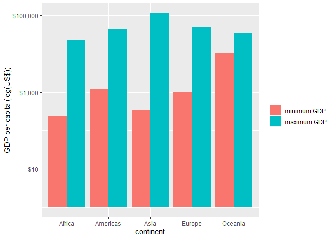
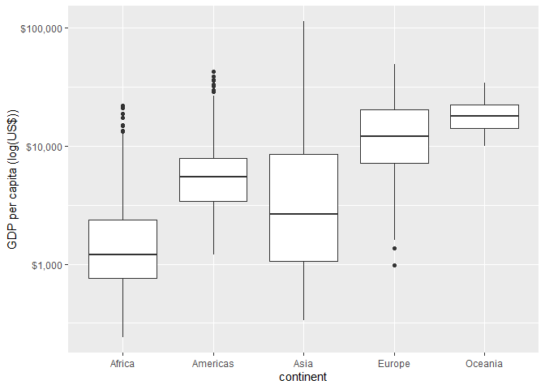

Assignment 3 - `dplyr` and `ggplot2`
================
Lulu Pei
25/09/2019

  - [Overview](#overview)
  - [Task 1](#task-1)
  - [Task 2](#task-2)
  - [Task 3](#task-3)

# Overview

In this assignment, we will be performing analysis on the `gapminder`
dataset. To access this dataset, we must load the `gapminder` package.
We will be performing analysis using `dplyr` functions, thus we will
also need to load its parent package, `tidyverse`.

``` r
library(gapminder)
library(tidyverse)
```

Now that we have our tools loaded and ready to go, let’s complete a few
tasks to gain a deeper understanding of the `gapminder` dataset.

# Task 1

As our first task, suppose we want to determine the absolute abundance
of countries with low life expectancy over time by continent (**task
option 1**). We will define low life expectancy to be below the global
mean life expectancy for that year. Let’s proceed through this task
step-by-step.

``` r
gapminder %>%
  select(continent, country, year, lifeExp) %>%
  group_by(year) %>%
  mutate(mean_lifeExp = mean(lifeExp))
```

    # A tibble: 1,704 x 5
    # Groups:   year [12]
       continent country      year lifeExp mean_lifeExp
       <fct>     <fct>       <int>   <dbl>        <dbl>
     1 Asia      Afghanistan  1952    28.8         49.1
     2 Asia      Afghanistan  1957    30.3         51.5
     3 Asia      Afghanistan  1962    32.0         53.6
     4 Asia      Afghanistan  1967    34.0         55.7
     5 Asia      Afghanistan  1972    36.1         57.6
     6 Asia      Afghanistan  1977    38.4         59.6
     7 Asia      Afghanistan  1982    39.9         61.5
     8 Asia      Afghanistan  1987    40.8         63.2
     9 Asia      Afghanistan  1992    41.7         64.2
    10 Asia      Afghanistan  1997    41.8         65.0
    # ... with 1,694 more rows

The above command prints out a subset of the original `gapminder`
dataset, containing `continent`, `country`, `year`, and `lifeExp`
columns in addition to a new `mean_lifeExp` column, which lists the mean
global life expectancy for the corresponding year. Next, we will
identify which countries in each continent can be regarded to have low
life expectancy each year.

``` r
gapminder %>%
  select(continent, country, year, lifeExp) %>%
  group_by(year) %>%
  mutate(mean_lifeExp = mean(lifeExp)) %>%
  group_by(continent) %>%
  filter(lifeExp < mean_lifeExp) 
```

    # A tibble: 824 x 5
    # Groups:   continent [4]
       continent country      year lifeExp mean_lifeExp
       <fct>     <fct>       <int>   <dbl>        <dbl>
     1 Asia      Afghanistan  1952    28.8         49.1
     2 Asia      Afghanistan  1957    30.3         51.5
     3 Asia      Afghanistan  1962    32.0         53.6
     4 Asia      Afghanistan  1967    34.0         55.7
     5 Asia      Afghanistan  1972    36.1         57.6
     6 Asia      Afghanistan  1977    38.4         59.6
     7 Asia      Afghanistan  1982    39.9         61.5
     8 Asia      Afghanistan  1987    40.8         63.2
     9 Asia      Afghanistan  1992    41.7         64.2
    10 Asia      Afghanistan  1997    41.8         65.0
    # ... with 814 more rows

This command filters out only those observations which have a life
expectancy less than the mean life expectancy for that year. We can see
that a total of 824 countries have had low life expectancy at some time
between 1952 and 2007. How many countries had low life expectancy in
each continent at specific years?

``` r
gapminder %>%
  select(continent, country, year, lifeExp) %>%
  group_by(year) %>%
  mutate(mean_lifeExp = mean(lifeExp)) %>%
  group_by(continent) %>%
  filter(lifeExp < mean_lifeExp) %>%
  group_by(year) %>%
  count(continent) %>%
  mutate("number of countries" = n) %>%
  select(year, continent, "number of countries")
```

    # A tibble: 44 x 3
    # Groups:   year [12]
        year continent `number of countries`
       <int> <fct>                     <int>
     1  1952 Africa                       50
     2  1952 Americas                      9
     3  1952 Asia                         22
     4  1952 Europe                        1
     5  1957 Africa                       50
     6  1957 Americas                      9
     7  1957 Asia                         20
     8  1957 Europe                        1
     9  1962 Africa                       50
    10  1962 Americas                      8
    # ... with 34 more rows

This output shows us a breakdown of the number of countries with low
life expectancy, grouped by year and continent. We can better visualize
this by plotting a stacked bar graph of country counts by continent and
year.

``` r
gapminder %>%
  select(continent, country, year, lifeExp) %>%
  group_by(year) %>%
  mutate(mean_lifeExp = mean(lifeExp)) %>%
  group_by(continent) %>%
  filter(lifeExp < mean_lifeExp) %>%
  group_by(year) %>%
  count(continent) %>%
  ggplot(aes(x = year, y = n, fill = continent)) +
  geom_bar(stat = "identity") +
  ylab("country count")
```


From this plot, we can observe that Africa has the greatest absolute
number of countries classified as having low life expectancy, while
Oceania has no countries with low life expectancy, followed by Europe
with very few low life expectancy countries. Over time, Africa seems to
have a consistent country count for low life expectancy, whereas the
Americas, Asia, and Europe have seen decreases in the abundance of
countries with low life expectancy - with Europe not having any
countries with low life expectancy by the 1990s.

However, in terms of comparing abundance between countries, it is
important to consider the relative abundance by including a denominator
in calculations. Let’s consider a denominator of total number of
countries within the continent in a particular year.

``` r
gapminder %>%
  select(continent, country, year, lifeExp) %>%
  group_by(year) %>%
  mutate(mean_lifeExp = mean(lifeExp)) %>%
  ungroup() %>%
  group_by(year, continent) %>%
  mutate(total_count = n()) %>%
  filter(lifeExp < mean_lifeExp) %>%
  group_by(year, continent) %>%
  mutate(number_of_countries = n()) %>%
  select(continent, year, number_of_countries, total_count) %>%
  mutate(relative_abundance = (number_of_countries / total_count)*100) %>%
  distinct()
```

    # A tibble: 44 x 5
    # Groups:   year, continent [44]
       continent  year number_of_countries total_count relative_abundance
       <fct>     <int>               <int>       <int>              <dbl>
     1 Asia       1952                  22          33               66.7
     2 Asia       1957                  20          33               60.6
     3 Asia       1962                  19          33               57.6
     4 Asia       1967                  18          33               54.5
     5 Asia       1972                  18          33               54.5
     6 Asia       1977                  14          33               42.4
     7 Asia       1982                  12          33               36.4
     8 Asia       1987                  12          33               36.4
     9 Asia       1992                  11          33               33.3
    10 Asia       1997                  10          33               30.3
    # ... with 34 more rows

By considering relative abundance, we can add more context to the value
in the tibble. While absolute abundance provides a count, relative
abundance provides a count in relation to a total (in this case, the
proportion of countries within a continent that have low life expectancy
for a given year). We see that in 1952, 67% of countries in Asia, 96% in
Africa, 36% in the Americas, 3% in Europe and 0% in Oceania had low life
expectancy. By 2007, these proportions were reduced to 30% in Asia, 86%
in Africa, 8% in the Americas, and no countries in Europe and Oceania.
We can plot these findings using a similar stacked bar plot.

``` r
gapminder %>%
  select(continent, country, year, lifeExp) %>%
  group_by(year) %>%
  mutate(mean_lifeExp = mean(lifeExp)) %>%
  ungroup() %>%
  group_by(year, continent) %>%
  mutate(total_count = n()) %>%
  filter(lifeExp < mean_lifeExp) %>%
  group_by(year, continent) %>%
  mutate(number_of_countries = n()) %>%
  select(continent, year, number_of_countries, total_count) %>%
  mutate(relative_abundance = (number_of_countries / total_count)*100) %>%
  distinct() %>%
  ggplot(aes(x = year, y = relative_abundance, fill = continent)) +
  geom_bar(stat = "identity") +
  ylab("relative abundance (%)")
```


From this relative abundance plot, we observe a similar pattern to the
absolute abundance plot. All continents have experienced reductions in
relative abundance of low life expectancy over the years, to some
extent. Africa seems to have had the slowest decline, while the Americas
and Asia have had the sharpest drops between 1952 and 2007.

# Task 2

For our next task, suppose we wanted to obtain the minimum and maximum
GDP per capita for all continents represented in the dataset (**task
option 2**). Our first step would be to group the data observations by
continent, and then subsequently compute minimum and maximum GDP per
capita within continent groupings.

``` r
gapminder %>%
  select(continent, gdpPercap) %>%
  group_by(continent) %>%
  summarise(min_GDP = min(gdpPercap), max_GDP = max(gdpPercap))
```

    ## # A tibble: 5 x 3
    ##   continent min_GDP max_GDP
    ##   <fct>       <dbl>   <dbl>
    ## 1 Africa       241.  21951.
    ## 2 Americas    1202.  42952.
    ## 3 Asia         331  113523.
    ## 4 Europe       974.  49357.
    ## 5 Oceania    10040.  34435.

This output allows us to observe the minimum and maximum GDP per capita
experienced by each continent between the years of 1952 and 2007. If we
wanted to graphically observe the relationship between minimum and
maximum GDP and how they vary between continents, we can plot
side-by-side bar plots.

``` r
gapminder %>%
  select(continent, gdpPercap) %>%
  group_by(continent) %>%
  mutate(min_GDP = min(gdpPercap), max_GDP = max(gdpPercap)) %>%
  filter(gdpPercap == min_GDP | gdpPercap == max_GDP) %>%
  mutate(gdp_magnitude = ifelse(gdpPercap == min_GDP, 0, 1)) %>% 
  # note: new "ifelse" function to create factorized column suitable for side-by-side bar graphs
  ggplot(aes(x = continent, y = gdpPercap, fill = factor(gdp_magnitude))) +
  geom_bar(stat = "identity", position = "dodge") +
  scale_y_log10("GDP per capita (log(US$))", labels = scales::dollar_format()) +
  scale_fill_discrete(name = " ", labels = c("minimum GDP", "maximum GDP"))
```



The plot above depicts minimum GDP values (pink bars) and maximum GDP
values (turquoise bars) for each continent. We can observe that Asia has
the greatest spread in GDP values between minimum and maximum, whereas
Oceania has the smallest range in GDP values. In addition, we can infer
that in the `gapminder` dataset, the country with the lowest GDP per
capita is in Africa while the country with the highest GDP per capita is
in Asia. We can confirm this through the following code chunk - we see
that the Democratic Republic of Congo in Africa has the lowest GDP per
capita of US$241.17 and Kuwait in Asia has the highest GDP per capita of
US$113,523.13.

``` r
gapminder %>%
  select(continent, country, gdpPercap) %>%
  mutate(min_GDP = min(gdpPercap), max_GDP = max(gdpPercap)) %>%
  filter(gdpPercap == min_GDP | gdpPercap == max_GDP) %>%
  select(continent, country, gdpPercap)
```

    # A tibble: 2 x 3
      continent country          gdpPercap
      <fct>     <fct>                <dbl>
    1 Africa    Congo, Dem. Rep.      241.
    2 Asia      Kuwait             113523.

To better assess distribution of GDP per capita within continents and
analyze spread, we can take a look at 5-number summaries. Here we will
construct a simplified version consisting of minimum, mean, median,
maximum, and standard deviation values.

``` r
gapminder %>%
  select(continent, gdpPercap) %>%
  group_by(continent) %>%
  summarise(min_GDP = min(gdpPercap), mean_GDP = mean(gdpPercap), median_GDP = median(gdpPercap), max_GDP = max(gdpPercap), sd_GDP = sd(gdpPercap))
```

    # A tibble: 5 x 6
      continent min_GDP mean_GDP median_GDP max_GDP sd_GDP
      <fct>       <dbl>    <dbl>      <dbl>   <dbl>  <dbl>
    1 Africa       241.    2194.      1192.  21951.  2828.
    2 Americas    1202.    7136.      5466.  42952.  6397.
    3 Asia         331     7902.      2647. 113523. 14045.
    4 Europe       974.   14469.     12082.  49357.  9355.
    5 Oceania    10040.   18622.     17983.  34435.  6359.

Let’s visualize this data through side-by-side box plots to better
compare GDP per capita spread between continents.

``` r
gapminder %>%
  select(continent, gdpPercap) %>%
  group_by(continent) %>%
  ggplot(aes(x = continent, y = gdpPercap)) +
  geom_boxplot() +
  scale_y_log10("GDP per capita (log(US$))", labels = scales::dollar_format())
```



These boxplots futher support our prior statements of Asia having the
widest spread in GDP per capita and Oceania having the smallest spread.
In addition, we note that within each continent, there is large
diversity in GDP per capita, as depicted by the long whiskers on either
end of the center box in each boxplot.

# Task 3

In our final task, let’s explore how life expectancy has been changing
over time in the different continents (**task option 5**). To achieve
this, we will consider the mean life expectancy of each continent at
each time point between 1952 and 2007.

``` r
gapminder %>%
  select(continent, year, lifeExp) %>%
  group_by(continent, year) %>%
  mutate(mean_lifeExp = mean(lifeExp)) %>%
  select(continent, year, mean_lifeExp) %>%
  distinct()
```

    # A tibble: 60 x 3
    # Groups:   continent, year [60]
       continent  year mean_lifeExp
       <fct>     <int>        <dbl>
     1 Asia       1952         46.3
     2 Asia       1957         49.3
     3 Asia       1962         51.6
     4 Asia       1967         54.7
     5 Asia       1972         57.3
     6 Asia       1977         59.6
     7 Asia       1982         62.6
     8 Asia       1987         64.9
     9 Asia       1992         66.5
    10 Asia       1997         68.0
    # ... with 50 more rows

The above code chunk prints out the mean life expectancy of each
continent at specific time points between 1952 and 2007. We see that
mean life expectancy has been increasing over time in all continents:
from values in 1952 of 46 years in Asia, 64 years in Europe, 39 years in
Africa, 53 years in the Americas, and 69 years in Oceania to values in
2007 of 71 years in Asia, 78 years in Europe, 55 years in Africa, 74
years in the Americas, and 81 years in Oceania. To investigate more
explicity how life expectancy has been changing over time, let’s plot a
time series graph with individual lines for each continent.

``` r
gapminder %>%
  select(continent, year, lifeExp) %>%
  group_by(continent, year) %>%
  mutate(mean_lifeExp = mean(lifeExp)) %>%
  select(continent, year, mean_lifeExp) %>%
  distinct() %>%
  ggplot(aes(x = year, y = mean_lifeExp, col = continent)) +
  geom_point(size = 2) +
  geom_line(size = 1) +
  ylab("mean life expectancy (years)")
```


From the time series plot, we can observe that all continents have
experienced relatively consistent linear increases in mean life
expectancy between 1952 and 2007, with the exception of Africa
experiencing a plateau between 1987 and 2002 and Oceania experiencing a
slight plateau between 1967 and 1972. We can also infer that the
Americas and Asia had the sharpest increases in life expectancy, whereas
Oceania and Europe had slower rates of life expectancy increase.
Overall, global life expectancy seems to be increasing linearly with
time.
