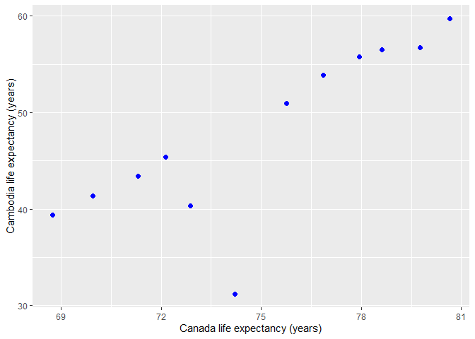

Assignment 4 - Tidy Data and Table Joins
================
Lulu Pei
03/10/2019

  - [Exercise 1: Univariate Data
    Reshaping](#exercise-1-univariate-data-reshaping)
      - [*Data Re-shaping*](#data-re-shaping)
      - [*Plotting*](#plotting)
      - [*Data Re-lengthening*](#data-re-lengthening)
  - [Exercise 2: Multivariate Data
    Reshaping](#exercise-2-multivariate-data-reshaping)
      - [*Data Re-shaping*](#data-re-shaping-1)
      - [*Data Re-lengthening*](#data-re-lengthening-1)
  - [Exercise 3: Table Joins](#exercise-3-table-joins)
      - [*3.1 - `left_join`*](#left_join)
      - [*3.2 - `anti_join`*](#anti_join)
      - [*3.3 -`full_join`*](#full_join)

In this assignment, we will be exploring methods of data tidying and
reshaping, as well as table joining. We will be performing these
manipulations using `dplyr` and `tidyr` functions, so we need to first
load their parent package, `tidyverse`. For the first two exercises, we
will be using the `gapminder` dataset, so we must also load the
`gapminder` package to access this data.

``` r
library(gapminder)
library(tidyverse)
```

With all of our tools loaded, let’s get started with the exercises\!

# Exercise 1: Univariate Data Reshaping

## *Data Re-shaping*

From our `gapminder` dataset, suppose we want to compare the life
expectancy between two countries by year. Let’s pick Canada and Cambodia
as our two countries. We will need to perform some re-shaping of the
`gapminder` dataset to obtain two separate columns for the life
expectancy of Canada and the life expectancy of Cambodia.

``` r
uni_wide <- gapminder %>%
  filter(country == "Canada" | country == "Cambodia") %>%
  select(year, country, lifeExp) %>%
  pivot_wider(id_cols = year, names_from = country, values_from = lifeExp) %>%
  arrange(year)
 
uni_wide %>%
  select(year, "Cambodia_lifeExp" = Cambodia, "Canada_lifeExp" = Canada)
```

    # A tibble: 12 x 3
        year Cambodia_lifeExp Canada_lifeExp
       <int>            <dbl>          <dbl>
     1  1952             39.4           68.8
     2  1957             41.4           70.0
     3  1962             43.4           71.3
     4  1967             45.4           72.1
     5  1972             40.3           72.9
     6  1977             31.2           74.2
     7  1982             51.0           75.8
     8  1987             53.9           76.9
     9  1992             55.8           78.0
    10  1997             56.5           78.6
    11  2002             56.8           79.8
    12  2007             59.7           80.7

The output tibble above provides the life expectancy of Cambodia and the
life expectancy of Canada in individual rows representing each time
point between 1952 and 2007 in the `gapminder` dataset.

## *Plotting*

To better visualize the relationship between life expectancy of Cambodia
and life expectancy of Canada, let’s create a scatterplot.

``` r
uni_wide %>%
  ggplot(aes(x = Canada, y = Cambodia)) +
  geom_point(colour = "blue", size = 2) +
  ylab("Cambodia life expectancy (years)") +
  xlab("Canada life expectancy (years)")
```



In the plot above, each point represents an observation from a time
point between 1952 and 2007, ordered chronologically from left to right.
We observe an overall positive relationship between life expectancy in
Cambodia and life expectancy in Canada, suggesting that between 1952 and
2007, both Cambodia and Canada have experienced increases in life
expectancy. However, we cannot ignore the significant drop in life
expectancy experienced by Cambodia between 1967 and 1977. Between these
two years, Canada continued to experience a consistent increase in life
expectancy, whereas Cambodia experienced a drop in life expectancy of
almost 15 years. This extreme decline can be attributed to the Khmer
Rouge genocide that occurred in Cambodia during that time, which
resulted in the deaths of nearly a quarter of Cambodia’s population.

## *Data Re-lengthening*

Now that we’ve performed our desired analysis on the widened subset of
the `gapminder` dataset, let’s re-lengthen it back to its original form.

``` r
uni_wide %>%
  pivot_longer(cols = (-year), names_to = "country", values_to = "lifeExp")
```

    # A tibble: 24 x 3
        year country  lifeExp
       <int> <chr>      <dbl>
     1  1952 Cambodia    39.4
     2  1952 Canada      68.8
     3  1957 Cambodia    41.4
     4  1957 Canada      70.0
     5  1962 Cambodia    43.4
     6  1962 Canada      71.3
     7  1967 Cambodia    45.4
     8  1967 Canada      72.1
     9  1972 Cambodia    40.3
    10  1972 Canada      72.9
    # ... with 14 more rows

The outputted tibble is in a longer format, with Cambodia and Canada
columns collapsed back into a single `country` column, with values going
to the `lifeExp` column.

# Exercise 2: Multivariate Data Reshaping

## *Data Re-shaping*

Let’s take a look at a multivariate case for data re-shaping. Suppose
that we are interested in investigating the life expectancy and GDP per
capita for two countries: Australia and Sweden. We must widen the
original `gapminder` dataset to contain separate columns for life
expectancy and GDP per capita values for Australia and Sweden, for each
time point between 1952 and 2007.

``` r
multi_wide <- gapminder %>%
  filter(country == "Australia" | country == "Sweden") %>%
  select(country, year, lifeExp, gdpPercap) %>%
  pivot_wider(id_cols = year, names_from = country, values_from = c(lifeExp, gdpPercap)) %>%
  arrange(year)

multi_wide %>%
  select(year, "Australia_lifeExp" = lifeExp_Australia, "Sweden_lifeExp" = lifeExp_Sweden, "Australia_gdp" = gdpPercap_Australia, "Sweden_gdp" = gdpPercap_Sweden)
```

    # A tibble: 12 x 5
        year Australia_lifeExp Sweden_lifeExp Australia_gdp Sweden_gdp
       <int>             <dbl>          <dbl>         <dbl>      <dbl>
     1  1952              69.1           71.9        10040.      8528.
     2  1957              70.3           72.5        10950.      9912.
     3  1962              70.9           73.4        12217.     12329.
     4  1967              71.1           74.2        14526.     15258.
     5  1972              71.9           74.7        16789.     17832.
     6  1977              73.5           75.4        18334.     18856.
     7  1982              74.7           76.4        19477.     20667.
     8  1987              76.3           77.2        21889.     23587.
     9  1992              77.6           78.2        23425.     23880.
    10  1997              78.8           79.4        26998.     25267.
    11  2002              80.4           80.0        30688.     29342.
    12  2007              81.2           80.9        34435.     33860.

The tibble above displays a summary of a subset of the `gapminder`
dataset, combining two observations from the original dataset into a
single row (characterized by year). We can easily identify the life
expectancy and GDP per capita for Australia and Sweden at any given time
point between 1952 and 2007.

## *Data Re-lengthening*

Now, suppose we want to re-lengthen our widened data back to its
original form.

``` r
multi_wide %>%
  pivot_longer(cols = (-year), names_to = c(".value", "country"), names_sep = "_")
```

    # A tibble: 24 x 4
        year country   lifeExp gdpPercap
       <int> <chr>       <dbl>     <dbl>
     1  1952 Australia    69.1    10040.
     2  1952 Sweden       71.9     8528.
     3  1957 Australia    70.3    10950.
     4  1957 Sweden       72.5     9912.
     5  1962 Australia    70.9    12217.
     6  1962 Sweden       73.4    12329.
     7  1967 Australia    71.1    14526.
     8  1967 Sweden       74.2    15258.
     9  1972 Australia    71.9    16789.
    10  1972 Sweden       74.7    17832.
    # ... with 14 more rows

We see that re-lengthening our data collapses country names back into
the `country` factor column, and a single observation per year becomes
to two separate observations for each country.

# Exercise 3: Table Joins

In this exercise, we will be using guestlist and email address tibbles
found on Github. Let’s first load these tibbles into our working
environment - we will name the guestlist tibble `guest` and the email
address tibble `email`.

``` r
(guest <- read_csv("https://raw.githubusercontent.com/STAT545-UBC/Classroom/master/data/wedding/attend.csv"))
```

    # A tibble: 30 x 7
       party name  meal_wedding meal_brunch attendance_wedd~ attendance_brun~
       <dbl> <chr> <chr>        <chr>       <chr>            <chr>           
     1     1 Somm~ PENDING      PENDING     PENDING          PENDING         
     2     1 Phil~ vegetarian   Menu C      CONFIRMED        CONFIRMED       
     3     1 Blan~ chicken      Menu A      CONFIRMED        CONFIRMED       
     4     1 Emaa~ PENDING      PENDING     PENDING          PENDING         
     5     2 Blai~ chicken      Menu C      CONFIRMED        CONFIRMED       
     6     2 Nige~ <NA>         <NA>        CANCELLED        CANCELLED       
     7     3 Sine~ PENDING      PENDING     PENDING          PENDING         
     8     4 Ayra~ vegetarian   Menu B      PENDING          PENDING         
     9     5 Atla~ PENDING      PENDING     PENDING          PENDING         
    10     5 Denz~ fish         Menu B      CONFIRMED        CONFIRMED       
    # ... with 20 more rows, and 1 more variable: attendance_golf <chr>

``` r
(email <- read_csv("https://raw.githubusercontent.com/STAT545-UBC/Classroom/master/data/wedding/emails.csv"))
```

    # A tibble: 14 x 2
       guest                                             email                 
       <chr>                                             <chr>                 
     1 Sommer Medrano, Phillip Medrano, Blanka Medrano,~ sommm@gmail.com       
     2 Blair Park, Nigel Webb                            bpark@gmail.com       
     3 Sinead English                                    singlish@hotmail.ca   
     4 Ayra Marks                                        marksa42@gmail.com    
     5 Jolene Welsh, Hayley Booker                       jw1987@hotmail.com    
     6 Amayah Sanford, Erika Foley                       erikaaaaaa@gmail.com  
     7 Ciaron Acosta                                     shining_ciaron@gmail.~
     8 Diana Stuart                                      doodledianastu@gmail.~
     9 Daisy-May Caldwell, Martin Caldwell, Violet Cald~ caldwellfamily5212@gm~
    10 Rosanna Bird, Kurtis Frost                        rosy1987b@gmail.com   
    11 Huma Stokes, Samuel Rutledge                      humastokes@gmail.com  
    12 Eddison Collier, Stewart Nicholls                 eddison.collier@gmail~
    13 Turner Jones                                      tjjones12@hotmail.ca  
    14 Albert Marshall, Vivian Marshall                  themarshallfamily1234~

## *3.1 - `left_join`*

Taking a look at the guestlist, we notice that it does not contain the
contact email addresses for each guest. Let’s fix this by adding an
additional email address column. Prior to joining these two tibbles, we
must slightly reshape the email address tibble. We can observe that a
single contact email address corresponds to many guests, listed as a
single observation with names separated by commas. We will need to
separate these comma-separated lists into individual rows for each
guest.

``` r
(email <- email %>% 
  separate_rows(guest, sep = ", ") %>%
  rename("name" = guest))
```

    # A tibble: 28 x 2
       name            email              
       <chr>           <chr>              
     1 Sommer Medrano  sommm@gmail.com    
     2 Phillip Medrano sommm@gmail.com    
     3 Blanka Medrano  sommm@gmail.com    
     4 Emaan Medrano   sommm@gmail.com    
     5 Blair Park      bpark@gmail.com    
     6 Nigel Webb      bpark@gmail.com    
     7 Sinead English  singlish@hotmail.ca
     8 Ayra Marks      marksa42@gmail.com 
     9 Jolene Welsh    jw1987@hotmail.com 
    10 Hayley Booker   jw1987@hotmail.com 
    # ... with 18 more rows

``` r
guest %>%
  left_join(email, by = "name")
```

    # A tibble: 30 x 8
       party name  meal_wedding meal_brunch attendance_wedd~ attendance_brun~
       <dbl> <chr> <chr>        <chr>       <chr>            <chr>           
     1     1 Somm~ PENDING      PENDING     PENDING          PENDING         
     2     1 Phil~ vegetarian   Menu C      CONFIRMED        CONFIRMED       
     3     1 Blan~ chicken      Menu A      CONFIRMED        CONFIRMED       
     4     1 Emaa~ PENDING      PENDING     PENDING          PENDING         
     5     2 Blai~ chicken      Menu C      CONFIRMED        CONFIRMED       
     6     2 Nige~ <NA>         <NA>        CANCELLED        CANCELLED       
     7     3 Sine~ PENDING      PENDING     PENDING          PENDING         
     8     4 Ayra~ vegetarian   Menu B      PENDING          PENDING         
     9     5 Atla~ PENDING      PENDING     PENDING          PENDING         
    10     5 Denz~ fish         Menu B      CONFIRMED        CONFIRMED       
    # ... with 20 more rows, and 2 more variables: attendance_golf <chr>,
    #   email <chr>

The output tibble is the original guestlist with the addition of an
`email` column containing the contact email address for each guest.

## *3.2 - `anti_join`*

We notice that there is some discrepancy between the number of guests on
the guestlist and the number of guests for which we have emails for in
the email address tibble. Suppose we want to know who we have emails for
but are not on the guestlist.

``` r
email %>%
  anti_join(guest, by = "name")
```

    # A tibble: 3 x 2
      name            email                          
      <chr>           <chr>                          
    1 Turner Jones    tjjones12@hotmail.ca           
    2 Albert Marshall themarshallfamily1234@gmail.com
    3 Vivian Marshall themarshallfamily1234@gmail.com

From this output, we see that three guests (Turner Jones, Albert
Marshall, and Vivian Marshall) in the email list are not on the
guestlist.

## *3.3 -`full_join`*

Now that we are aware of this discrepancy between the two tibbles, let’s
make a master list containing all guests who we have emails for, in
addition to those on the guestlist.

``` r
guest %>%
  full_join(email, by = "name")
```

    # A tibble: 33 x 8
       party name  meal_wedding meal_brunch attendance_wedd~ attendance_brun~
       <dbl> <chr> <chr>        <chr>       <chr>            <chr>           
     1     1 Somm~ PENDING      PENDING     PENDING          PENDING         
     2     1 Phil~ vegetarian   Menu C      CONFIRMED        CONFIRMED       
     3     1 Blan~ chicken      Menu A      CONFIRMED        CONFIRMED       
     4     1 Emaa~ PENDING      PENDING     PENDING          PENDING         
     5     2 Blai~ chicken      Menu C      CONFIRMED        CONFIRMED       
     6     2 Nige~ <NA>         <NA>        CANCELLED        CANCELLED       
     7     3 Sine~ PENDING      PENDING     PENDING          PENDING         
     8     4 Ayra~ vegetarian   Menu B      PENDING          PENDING         
     9     5 Atla~ PENDING      PENDING     PENDING          PENDING         
    10     5 Denz~ fish         Menu B      CONFIRMED        CONFIRMED       
    # ... with 23 more rows, and 2 more variables: attendance_golf <chr>,
    #   email <chr>

This data tibble is essentially the concatenated form of the guestlist
and email list - including the three guests who were not originally on
the guestlist.
