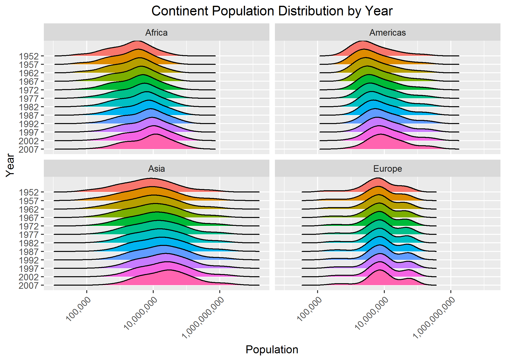

# Overview

In this assignment, we will be looking at factor management, reading in and writing out files, and figure design and output. We will be investigating these properties using the `gapminder` dataset and some handy `tidyverse` and `forcats` functions - let's load these packages. 

```{r, message = FALSE}
library(gapminder)
library(tidyverse)
library(forcats)
```

# Exercise 1 - `here::here` package

The `here::here` package in R allows for a more robust method of sharing code among users with different directory structures and using different operating systems (Windows, Mac, etc.). `here()` creates a platform-independent path to a specified file that does not entail writing out the entire file path, which can be problematic in two main ways. Firstly, the syntax for file paths differ between operating systems (Windows uses backslashes “\”, whereas Mac uses forward-slashes “/”), reducing the robustness and reproducibility of a code chunk. Secondly, and arguably most importantly, the absolute path to a specific file or directory on a user’s computer is unique to that user’s computer – other users will not have the exact same directory setup and thus running the code will output “file/directory not found” errors. The `here::here` package eliminates these issues by selecting and defining the root directory without the user having to specify the path – it does this by looking for a `.Rproj` file or a `.here` file. Once this root directory is set, `here` works with paths within this root directory in a platform-independent and more robust manner. 


# Exercise 2 - factor management

## Dropping factor levels

In this exercise, we will be exploring factor variables and how to drop and re-order them. Let's take a look at the `continent` variable in the `gapminder` dataset.

```{r, comment = NA}
gapminder$continent %>%
  class()

gapminder$continent %>%
  nlevels()

gapminder$continent %>%
  levels()
```

We see that the `continent` variable is indeed a factor with five distinct levels of Africa, Americas, Asia, Europe, and Oceania. Suppose we want to drop Oceania in a filtered version of the `gapminder` dataset.

```{r, comment = NA}
filtered_gap <- gapminder %>%
  filter(!(continent == "Oceania"))

DT::datatable(filtered_gap)
```

Now, let's see how many levels the `continent` variable has in the filtered dataset. 

```{r, comment = NA}
filtered_gap$continent %>%
  nlevels() 

filtered_gap$continent %>%
  levels() 
```

We see that the original five levels are still preserved; however, because we removed the `Oceania` level, we would expect there to be only four levels. Let's fix this by removing unused factor levels.

```{r, comment= NA}
filtered_gap <- gapminder %>%
  filter(!(continent == "Oceania")) %>%
  droplevels()

filtered_gap$continent %>%
  nlevels() 

filtered_gap$continent %>%
  levels() 
```

Now we are left with four levels, corresponding to the four continents that we are interested in: Africa, Americas, Asia, and Europe. 

We can also observe what effect dropping the "Oceania" level had on the original gapminder dataset by taking a look at the total number of rows before and after modification.

```{r, comment = NA}
# before dropping level
nrow(gapminder)

# after dropping level
nrow(filtered_gap)
```

We can see that the total number of rows decreased from `r nrow(gapminder)` to `r nrow(filtered_gap)`, corresponding to the loss of observations from Oceania. 

## Reordering factor levels

Next, let's investigate how we can reorder levels of a factor variable based on some summary statistic of a quantitative variable. We will continue to use the `continent` factor variable. Suppose we want to reorder continents by change in average life expectancy between 1952 and 2007. First, we will need to create a new column containing values for the average change in life expectancy. 

```{r, comment = NA}
reordered_gap <- gapminder %>%
  filter(year == 1952 | year == 2007) %>%
  group_by(continent, year) %>%
  mutate(mean_lifeExp = mean(lifeExp)) %>%
  select("continent", "year", "mean_lifeExp") %>%
  distinct() %>%
  ungroup(year) %>%
  group_by(continent) %>%
  mutate(change_lifeExp = mean_lifeExp - lag(mean_lifeExp))

knitr::kable(reordered_gap)
```

From this output tibble, we can observe the change in mean life expectancy between 1952 and 2007 for each of the five continents included in the gapminder dataset. Now, let's take a look at how we can reorder continents by magnitude of life expectancy change. 

```{r, warning = FALSE, fig.width = 10}
# plot prior to reordering
unordered <- reordered_gap %>%
  ggplot(aes(x = continent, y = change_lifeExp, colour = continent)) +
  geom_point(size = 2) +
  theme(legend.position = "none") +
  ggtitle("Change in Life Expectancy by Continent (original)") +
  xlab("Continent") +
  ylab("Change in Life Expectancy (years)")

# plot with reordering of factor levels
reordered <- reordered_gap %>%
  ungroup() %>%
  drop_na(change_lifeExp) %>%
  ggplot(aes(x = fct_reorder(continent, change_lifeExp), y = change_lifeExp, colour = continent)) +
  geom_point(size = 2) +
  theme(legend.position = "none") +
  ggtitle("Change in Life Expectancy by Continent (reordered)") +
  xlab("Continent") +
  ylab("Change in Life Expectancy (years)")

cowplot::plot_grid(unordered, reordered, 
          ncol = 2, nrow = 1)
```

The scatterplot on the left shows change in life expectancy by continent, prior to reordering. We see that `ggplot` has used the alphabetical order default to plot the observations. However, it would probably make more sense if we could plot the relationship between life expectancy change and continent in some order, such as ascending from smallest to largest change in life expectancy. This plot is depicted on the right, where continents have been reordered by increasing change in life expectancy between 1952 and 2007. In the reordered plot, it is more intuitive that Oceania had the smallest change in life expectancy, while Asia had a significantly larger increase in life expectancy. 

We can also achieve similar results using the `dplyr::arrange` function. Instead of reordering observations during the plotting stage, we can create a re-arranged dataset directly.

```{r}
# original data
reordered_gap %>%
  drop_na(change_lifeExp) %>%
  knitr::kable()

# re-arranged data by change in life expectancy
reordered_gap %>%
  drop_na(change_lifeExp) %>%
  arrange(change_lifeExp) %>%
  knitr::kable()

# arranged_gap %>%
  # ggplot(aes(x = continent, y = change_lifeExp, colour = continent)) +
           # geom_point(size = 3) +
           # theme(legend.position = "none")
```


# Exercise 3 - file input and output 

In this exercise, we will be exporting datasets to our local disk and reloading them back into our R environment, implementing the `here::here` command. 

Let's perform some basic manipulations of the `gapminder` dataset prior to writing it out to our disk. Suppose we want to filter only the observations from Europe and compute the mean life expectancy for each country within the Europe continent. 

```{r}
modified_gap <- gapminder %>%
  filter(continent == "Europe") %>%
  group_by(country) %>%
  mutate(mean_lifeExp = mean(lifeExp)) %>%
  select(country, continent, mean_lifeExp) %>%
  distinct()

DT::datatable(modified_gap)
```

Now, with this modified dataframe, let's export it using the `write_csv` command - we will locate our working directory using `here::here` for increased robustness of code. 

```{r}
write_csv(modified_gap, here::here("modified_gap.csv"))
```

Upon examination of the exported dataset, it seems to have exported successfully.

Let's reload the modified dataset back into our working environment so we can perform some more analysis!

```{r}
reload_gap <- read_csv(here::here("modified_gap.csv"))

DT::datatable(reload_gap)
```

From the output messages, we see that re-importing our modified gapminder dataset converted `continent` and `country` variables into character variables. We need to address this issue so that these _factor_ variables have the proper levels. To correct the misclassifcation, we specify an additional argument in the `read_csv` function.

```{r}
reload_gap <- read_csv(here::here("modified_gap.csv"), 
                       col_types = cols(continent = col_factor(), 
                                        country = col_factor()))

DT::datatable(reload_gap)
```

We have now successfully exported and reloaded our dataframe - variables are properly classified and the imported and exported datasets match. 

Suppose we want to plot mean life expectancy for countries in Europe with a mean life expectancy less than the overall mean life expectancy in Europe. Let's first identify these countries. 

```{r, fig.width = 7, fig.align = "center"}
reload_gap %>%
  filter(mean_lifeExp < mean(mean_lifeExp)) %>%
  ggplot(aes(x = country, y = mean_lifeExp, colour = country)) +
  geom_point(size = 2) +
  theme(legend.position = "none", axis.text.x = element_text(angle = 45, hjust = 1)) +
  xlab("Country") +
  ylab("Average Life Expectancy (years)")
```

Now, let's try to reorder our data in the order of increasing average life expectancy.

```{r, fig.align='center'}
reload_gap %>%
  filter(mean_lifeExp < mean(mean_lifeExp)) %>%
  ggplot(aes(x = fct_reorder(country, mean_lifeExp), y = mean_lifeExp, colour = country)) +
  geom_point(size = 2) +
  theme(legend.position = "none", axis.text.x = element_text(angle = 45, hjust = 1)) +
  xlab("Country") +
  ylab("Average Life Expectancy (years)")
```

# Exercise 4 - visualization design

In this exercise, we will look at effective visualization. I will be working towards improving a figure made in Assignment 2 showing population distribution by year through side-by-side boxplots.

```{r, comment = NA, message = NA, warning = NA, fig.width=10}
original_plot <- gapminder %>%
  mutate(year = factor(year)) %>%
  ggplot(aes(year, pop)) +
  geom_boxplot() +
  scale_y_log10("Population (log scale)") +
  xlab("Year")

new_plot <- gapminder %>%
  mutate(year = factor(year)) %>%
  filter(continent != "Oceania") %>%
  ggplot(aes(x = pop, y = fct_rev(year), fill = year)) +
  ggridges::geom_density_ridges() +
  facet_wrap(~continent) +
  scale_x_log10("Population", labels = scales::comma_format()) +
  ylab("Year") +
  ggtitle("Continent Population Distribution by Year") +
  theme(plot.title = element_text(hjust = 0.5), legend.position = "none", axis.text.x = element_text(angle = 45, hjust = 1))

cowplot::plot_grid(original_plot, new_plot, 
          ncol = 2, nrow = 1)
```

In the original plot (left), population distribution is depicted using boxplots for each of the 12 years. Those who are familiar with boxplots can interpret them to contain valuable insight, such as minimum, maximum, median, quantiles, and outliers - however, it's not the most visually intuitive. The improved version of the plot (right) depicts similar information, but using density curves instead of boxplots. I have faceted the overall graph into four smaller sub-plots representing four continents (Oceania was not included due to too few observations to create a meaningful density plot). From the sub-plots, we can observe changes in population distribution over time in each continent. We observe that Europe has had a relatively consistent population distribution between 1952 and 2007, whereas Asia appears to have had the most significant increase in population, which can be inferred by looking at the main peaks of each density curve. We can also see that the shape of the population distribution has remained constant within each continent between 1952 and 2007, with Asia having the largest spread in population and Europe having the smallest spread. As an additional improvement, I have converted the population labels into a more readable form and have included colours and a plot title for visual appeal and clarity. 

# Exercise 5 - writing figures to file

Next, we will export and save our new and improved plot of population distribution by year.

```{r, comment = NA}
ggsave(here::here("pop_dist.png"), plot = new_plot)
```

Now, let's reload and embed this plot back into our report. View the new and improved population distribution plot 


