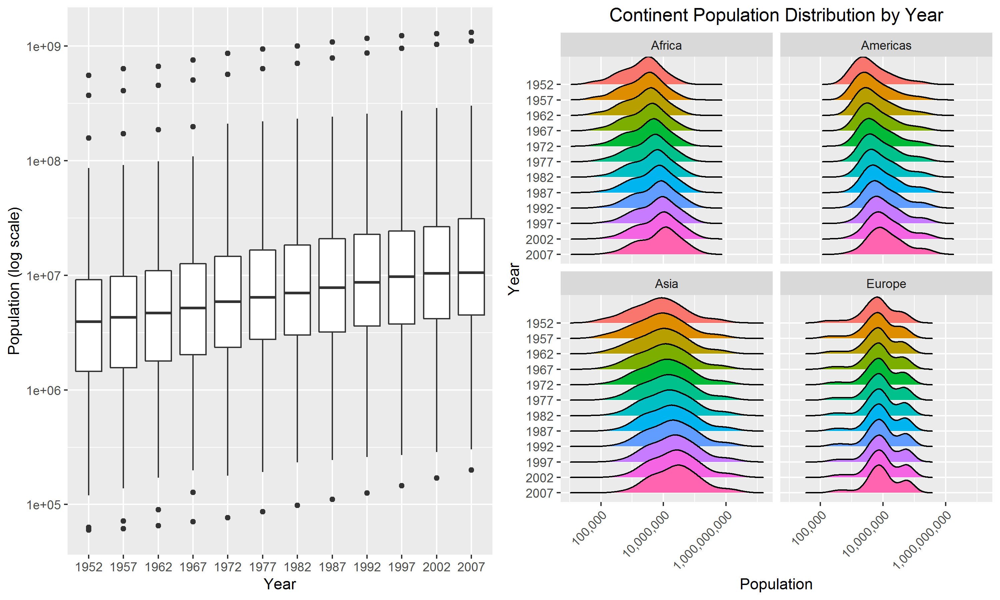

# Overview

In this assignment, we will be looking at factor management, reading in and writing out files, and figure design and output. We will be investigating these properties using the `gapminder` dataset and some handy `tidyverse` and `forcats` functions - let's load these packages. 

```{r, message = FALSE}
library(gapminder)
library(tidyverse)
library(forcats)
```

# Exercise 1 - `here::here` package

The `here::here` package in R allows for a more robust method of sharing code among users with different directory structures and using different operating systems (Windows, Mac, etc.). `here()` creates a platform-independent path to a specified file that does not entail writing out the entire file path, which can be problematic in two main ways. Firstly, the syntax for file paths differ between operating systems (Windows uses backslashes, whereas Mac uses forward-slashes), reducing the robustness and reproducibility of a code chunk. Secondly, and arguably most importantly, the absolute path to a specific file or directory on a user’s computer is unique to that user’s computer – other users will not have the exact same directory setup and thus running the code will output “file/directory not found” errors. The `here::here` package eliminates these issues by selecting and defining the root directory without the user having to specify the path – it does this by looking for a `.Rproj` file or a `.here` file. Once this root directory is set, `here` works with paths within this root directory in a platform-independent and more robust manner. Because `here::here` eliminates the need for the user to manually specify the working directory, it allows easier and more robust navigation of files even outside of projects. Loading files into the R workspace and saving output files to other sub-directories using `here::here` without the need for specifying absolute paths improves robustness and reproducibility while running shared code. 

# Exercise 2 - factor management

## Dropping factor levels

In this exercise, we will be exploring factor variables and how to drop and re-order them. Let's take a look at the `continent` variable in the `gapminder` dataset.

```{r, comment = NA}
gapminder$continent %>%
  class()

gapminder$continent %>%
  nlevels()

gapminder$continent %>%
  levels()
```

We see that `continent` is indeed a factor with five distinct levels of Africa, Americas, Asia, Europe, and Oceania. Suppose we want to drop Oceania in a filtered version of the `gapminder` dataset.

```{r, comment = NA}
filtered_gap <- gapminder %>%
  filter(continent != "Oceania")

DT::datatable(filtered_gap)
```

Now, let's see how many levels the `continent` variable has in the filtered dataset. 

```{r, comment = NA}
filtered_gap$continent %>%
  nlevels() 

filtered_gap$continent %>%
  levels() 
```

We see that the original five levels are still preserved; however, because we removed the `Oceania` level, we would expect there to be only four levels. Let's fix this by removing unused factor levels.

```{r, comment= NA}
filtered_gap <- gapminder %>%
  filter(!(continent == "Oceania")) %>%
  droplevels()

filtered_gap$continent %>%
  nlevels() 

filtered_gap$continent %>%
  levels() 
```

Now we are left with four levels, corresponding to the four continents that we are interested in: Africa, Americas, Asia, and Europe. 

We can also observe the effect dropping `Oceania` had on the original gapminder dataset by taking a look at the total number of rows before and after modification.

```{r, comment = NA}
# before dropping level
nrow(gapminder)

# after dropping level
nrow(filtered_gap)
```

The total number of rows decreased from `r nrow(gapminder)` to `r nrow(filtered_gap)`, corresponding to the loss of the `r nrow(gapminder) - nrow(filtered_gap)` observations from Oceania. 

## Reordering factor levels

Next, let's investigate how we can reorder levels of a factor variable based on some summary statistic of a quantitative variable. We will continue to use the `continent` factor variable. Suppose we want to reorder continents by change in average life expectancy between 1952 and 2007. First, we will need to create a new column containing values for the change in mean life expectancy. 

```{r, comment = NA}
reordered_gap <- gapminder %>%
  filter(year == 1952 | year == 2007) %>%
  group_by(continent, year) %>%
  mutate(mean_lifeExp = mean(lifeExp)) %>%
  select("continent", "year", "mean_lifeExp") %>%
  distinct() %>%
  ungroup(year) %>%
  group_by(continent) %>%
  mutate(change_lifeExp = mean_lifeExp - lag(mean_lifeExp)) %>%
  drop_na(change_lifeExp) %>%
  select(continent, change_lifeExp)

knitr::kable(reordered_gap)
```

From this output table, we can observe the change in mean life expectancy between 1952 and 2007 for each of the five continents included in the gapminder dataset. Now, let's take a look at how we can reorder continents by magnitude of life expectancy change. 

Through playing around with `dplyr` functions, we know that the function `arrange` will reorder a variable of interest by some defined order. Let's try this method to reorder continents by magnitude of life expectancy change and create plots before and after reordering.

```{r, fig.width = 10}
# original dataset without reordering
ori_plot <- reordered_gap %>%
  ggplot(aes(x = continent, y = change_lifeExp, colour = continent)) +
  geom_point(size = 2.5) +
  theme(legend.position = "none") +
  xlab("Continent") +
  ylab("Change in Life Expectancy (years)") +
  ggtitle("Change in Life Expectancy by Continent (original)")

# re-arranged dataset from smallest to largest life expectancy change
re_plot <- rearranged_gap <- reordered_gap %>%
  arrange(change_lifeExp) %>%
  ggplot(aes(x = continent, y = change_lifeExp, colour = continent)) +
  geom_point(size = 2.5) +
  theme(legend.position = "none") +
  xlab("Continent") +
  ylab("Change in Life Expectancy (years)") +
  ggtitle("Change in Life Expectancy by Continent (re-arranged)")

cowplot::plot_grid(ori_plot, re_plot, 
          ncol = 2, nrow = 1)
```

In the above graphs, we see that inputting an arranged dataframe into `ggplot` did not change the final output figure - continents are still ordered in the default alphabetical order. Here, the function `arrange` did not successfully help us in what we are trying to achieve. This is because `arrange` only reorders rows in our dataset, it does not affect factor levels or the order of axis labels in plots. Let's try an alternative method using `fct_reorder`.

```{r, warning = FALSE, fig.width = 10}
# plot prior to reordering
unordered <- reordered_gap %>%
  ggplot(aes(x = continent, y = change_lifeExp, colour = continent)) +
  geom_point(size = 2.5) +
  theme(legend.position = "none") +
  ggtitle("Change in Life Expectancy by Continent (original)") +
  xlab("Continent") +
  ylab("Change in Life Expectancy (years)")

# plot with reordering of factor levels
reordered <- reordered_gap %>%
  ggplot(aes(x = fct_reorder(continent, change_lifeExp), y = change_lifeExp, colour = continent)) +
  geom_point(size = 2.5) +
  theme(legend.position = "none") +
  ggtitle("Change in Life Expectancy by Continent (reordered)") +
  xlab("Continent") +
  ylab("Change in Life Expectancy (years)")

cowplot::plot_grid(unordered, reordered, 
          ncol = 2, nrow = 1)
```

The scatterplot on the left shows change in life expectancy by continent, prior to reordering. We see that `ggplot` has used the alphabetical order default to plot the observations. However, it would probably make more sense if we could plot the relationship between life expectancy change and continent in some order, such as ascending from smallest to largest change in life expectancy. This plot is depicted on the right, where continents have been reordered by increasing change in life expectancy between 1952 and 2007. In the reordered plot, it is more intuitive that Oceania had the smallest change in life expectancy, while Asia had a significantly larger increase in life expectancy. 

# Exercise 3 - file input and output 

In this exercise, we will be exporting datasets to disk and reloading them back into our R environment, implementing the `here::here` command. 

Let's perform some basic manipulations of the `gapminder` dataset prior to writing it out. Suppose we want to filter only the observations from Europe and compute the mean life expectancy for each country within the Europe continent. 

```{r}
modified_gap <- gapminder %>%
  filter(continent == "Europe") %>%
  group_by(country) %>%
  mutate(mean_lifeExp = mean(lifeExp)) %>%
  select(country, continent, mean_lifeExp) %>%
  distinct()

DT::datatable(modified_gap)
```

Now, with this modified dataframe, let's export it using the `write_csv` command - we will locate our root directory using `here::here` for increased robustness of code. 

```{r}
write_csv(modified_gap, here::here("modified_gap.csv"))
```

Upon examination of the exported dataset, it seems to have exported successfully.

Let's reload the modified dataset back into our working environment so we can perform some more analysis!

```{r, comment = NA}
reload_gap <- read_csv(here::here("modified_gap.csv"))

DT::datatable(reload_gap)
```

From the output messages, we see that re-importing our modified gapminder dataset converted `continent` and `country` variables into character variables. We need to address this issue so that these __factor__ variables have the proper levels. To correct the misclassifcation, we specify an additional argument in the `read_csv` function.

```{r, comment = NA}
reload_gap <- read_csv(here::here("modified_gap.csv"), 
                       col_types = cols(continent = col_factor(), 
                                        country = col_factor()))

DT::datatable(reload_gap)

reload_gap$continent %>%
  nlevels()

reload_gap$country %>%
  nlevels()
```

We have now successfully exported and reloaded our dataframe - variables are properly classified (with the correct number of levels for the factor variables) and the imported and exported datasets match. 

Suppose we want to plot mean life expectancy for countries in Europe with a mean life expectancy less than the overall mean life expectancy in Europe. Let's first identify these countries. 

```{r, fig.width = 7, fig.align = "center"}
reload_gap %>%
  filter(mean_lifeExp < mean(mean_lifeExp)) %>%
  ggplot(aes(x = country, y = mean_lifeExp, colour = country)) +
  geom_point(size = 2.5) +
  xlab("Country") +
  ylab("Average Life Expectancy (years)") + 
  ggtitle("Average Life Expectancy by European Country (original)") +
  theme(legend.position = "none", axis.text.x = element_text(angle = 45, hjust = 1), plot.title = element_text(hjust = 0.5))
```

Now, let's improve this visualization by reordering our data in the order of increasing average life expectancy.

```{r, fig.align='center'}
reload_gap %>%
  filter(mean_lifeExp < mean(mean_lifeExp)) %>%
  ggplot(aes(x = fct_reorder(country, mean_lifeExp), y = mean_lifeExp, colour = country)) +
  geom_point(size = 2.5) +
  xlab("Country") +
  ylab("Average Life Expectancy (years)") +
  ggtitle("Average Life Expectancy by European Country (reordered)") +
  theme(legend.position = "none", axis.text.x = element_text(angle = 45, hjust = 1), plot.title = element_text(hjust = 0.5))
```

From this reordered plot, we can clearly observe that most European countries had relatively similar life expectancies ranging between approximately 68 to 72 years; however, it is evident that Turkey had a significantly lower average life expectancy compared to the other European countries.

# Exercise 4 - visualization design

In this exercise, we will look at effective visualization. I will be working towards improving a figure made in Assignment 2 showing population distribution by year through side-by-side boxplots.

```{r, comment = NA, message = NA, warning = NA, fig.width=10}
original_plot <- gapminder %>%
  mutate(year = factor(year)) %>%
  ggplot(aes(year, pop)) +
  geom_boxplot() +
  scale_y_log10("Population (log scale)") +
  xlab("Year")

new_plot <- gapminder %>%
  mutate(year = factor(year)) %>%
  filter(continent != "Oceania") %>%
  ggplot(aes(x = pop, y = fct_rev(year), fill = year)) +
  ggridges::geom_density_ridges() +
  facet_wrap(~continent) +
  scale_x_log10("Population", labels = scales::comma_format()) +
  ylab("Year") +
  ggtitle("Continent Population Distribution by Year") +
  theme(plot.title = element_text(hjust = 0.5), legend.position = "none", axis.text.x = element_text(angle = 45, hjust = 1))

cowplot::plot_grid(original_plot, new_plot, 
          ncol = 2, nrow = 1)
```

In the original plot (left), population distribution is depicted using boxplots for each year. Those who are familiar with boxplots can interpret them to contain valuable insight, such as minimum, maximum, median, quartiles, and outliers - however, it is not the most visually intuitive plot. The improved version (right) depicts similar information, but using density curves instead of boxplots. I have faceted the overall graph into four smaller sub-plots representing four continents (Oceania was not included due to too few observations to create a meaningful density curve). From the sub-plots, we can observe changes in population distribution over time in each continent. We observe that Europe has had a relatively consistent population distribution between 1952 and 2007, whereas Asia appears to have had the most significant increase in population, which can be inferred by looking at the main peaks of each density curve. We can also see that the shape of the population distribution has remained consistent within each continent between 1952 and 2007, with Asia having the largest spread in population and Europe having the smallest spread. As an additional improvement, I have converted the population labels into a more readable form and have included colours and a plot title for visual appeal and clarity. 

# Exercise 5 - writing figures to file

Next, we will export and save our new and improved plot of population distribution by year using `ggsave`. The default of the `ggsave` function is to save the last plot that was displayed which may not be the plot of interest; thus, it is important to explicitly state which plot to save as an argument in the `ggsave` function. Let's see an example of this. 

```{r, comment = NA}
# without explicit naming of plot
ggsave(here::here("trial_plot.png"),
       device = "png",
       width = 10,
       height = 6)

# explict naming of plot
ggsave(here::here("pop_dist.png"), 
       plot = new_plot, 
       device = "png",
       dpi = 300, 
       width = 8,
       height = 6, 
       units = "in")
```

`ggsave` has additional arguments such as `device`, `width`, `height`, and resolution to improve figure visualization - I have played around with these arguments in the code above. 

Let's reload and embed the saved plots back into our report to see if there was a difference in explicitly naming the plot to be saved. 

Here is the plot without specifying the `plot =` argument.



We see that this is the incorrect plot - it's the last displayed plot of the side-by-side comparison between original and newly improved plots.

Here is the plot with explicit specification of the plot to be saved.


Now this is the plot that we were actually trying to save: the improved visualization of continent population distribution by year.

These figures can also be embedded through links: here is the [default plot](trial_plot.png) and here is the [correctly saved plot](pop_dist.png).
